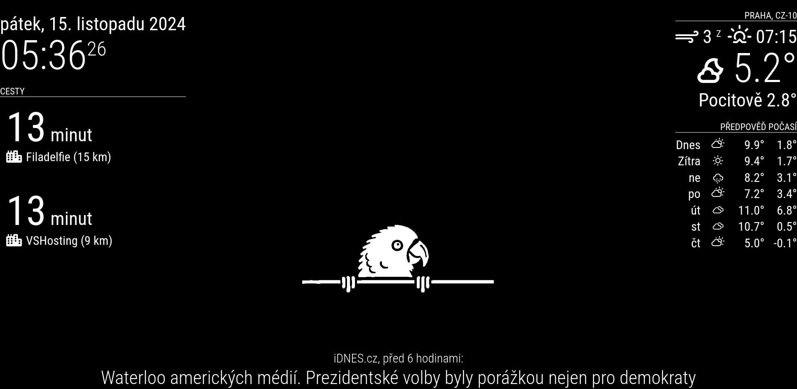

# MMM-parrot-or-gif

This module displays a parrot GIF or any other GIF on the screen.

## Installation

1. Clone this repository into the `modules` folder of your MagicMirror directory:
    ```sh
    git clone https://github.com/yourusername/MMM-parrot-or-gif.git
    ```

2. Navigate to the module folder:
    ```sh
    cd MMM-parrot-or-gif
    ```

3. Install the dependencies:
    ```sh
    npm install
    ```

## Configuration

Add the following configuration to your `config.js` file of MagicMirror:

```js
{
    module: "MMM-parrot-or-gif",
    position: "lower_third", // or any other position of your choice
    config: {
        gif: "kuchtik.gif", // name of the GIF file in the gifs folder
        animationSpeed: 3000,
        alwaysOnTheScreen: false,
        showGifEvery: 60 * 3 * 1000, // 3 minutes
        showGifFor: 20000, // 20 seconds
        scaleGif: 0.25,
    }
}
```

### Configuration Options

| Option            | Description                                      | Default Value       |
|-------------------|--------------------------------------------------|---------------------|
| `gif`             | Name of the GIF file in the gifs folder          | `"kuchtik.gif"`     |
| `animationSpeed`  | Speed of the animation in milliseconds           | `3000`              |
| `alwaysOnTheScreen` | Whether the GIF is always on the screen         | `false`             |
| `showGifEvery`    | Interval in milliseconds to show the GIF         | `180000` (3 minutes)|
| `showGifFor`      | Duration in milliseconds to show the GIF         | `20000` (20 seconds)|
| `scaleGif`        | Scale of the GIF                                 | `0.25`               |

### Note

If the parrot GIF does not appear, please wait for the interval specified by `showGifEvery` or set `alwaysOnTheScreen` to `true` to have the GIF always displayed.

## Screenshots

Here are some screenshots of the module in action:

